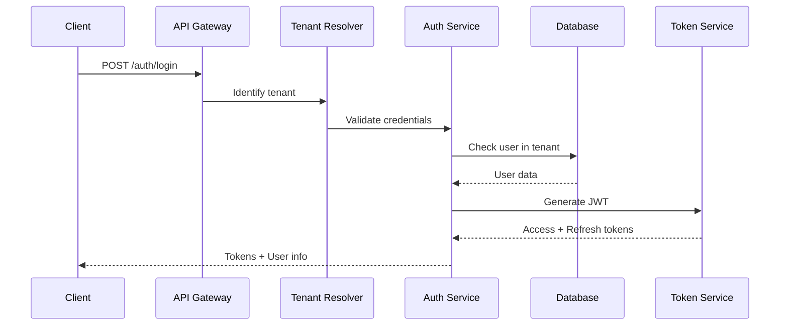
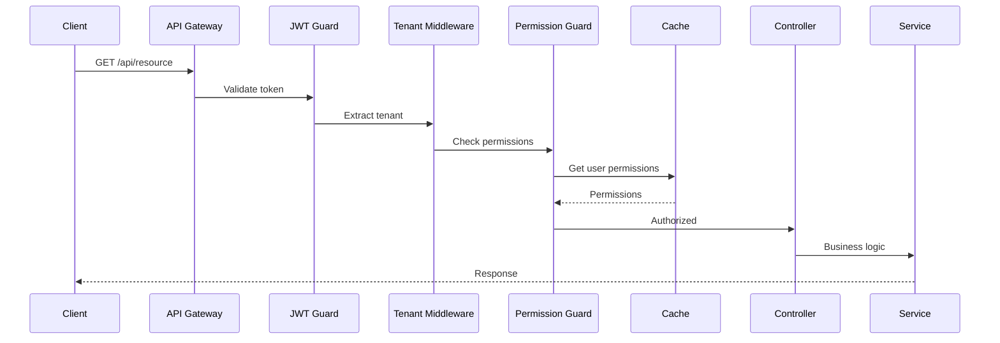

# Product Requirements Document (PRD)

## Sistema de Multi-Tenancy e Autenticação - Backend

### 1. Visão Geral

#### 1.1 Objetivo

Desenvolver um sistema robusto de multi-tenancy com autenticação e autorização para suportar múltiplas organizações isoladas (tenants) em uma única aplicação SaaS, garantindo segurança, escalabilidade e isolamento de dados.

#### 1.2 Contexto

O Connectabil Hub é uma plataforma educacional e de mentoria que precisa suportar múltiplas organizações independentes, cada uma com seus próprios usuários, dados, configurações e personalizações, mantendo total isolamento entre tenants.

#### 1.3 Stakeholders

- **Usuários Finais**: Estudantes, professores, mentores, administradores de tenant
- **Administradores da Plataforma**: Super admins do sistema
- **Equipe de Desenvolvimento**: Backend, Frontend, DevOps
- **Equipe de Segurança**: Compliance e auditoria

### 2. Requisitos Funcionais

#### 2.1 Gestão de Tenants

##### 2.1.1 Criação de Tenant

- **RF001**: Sistema deve permitir criação de novo tenant via API administrativa
- **RF002**: Cada tenant deve ter subdomain único (ex: acme.connectabil.com)
- **RF003**: Validação de unicidade de subdomain em tempo real
- **RF004**: Provisionamento automático de recursos básicos ao criar tenant
- **RF005**: Suporte a trial period configurável por tenant

##### 2.1.2 Identificação de Tenant

- **RF006**: Identificação por subdomain na URL
- **RF007**: Identificação por custom domain (domínio próprio)
- **RF008**: Identificação por header HTTP (X-Tenant-ID) para APIs
- **RF009**: Fallback para tenant padrão em caso de não identificação

##### 2.1.3 Configuração de Tenant

- **RF010**: Personalização de branding (logo, cores, CSS customizado)
- **RF011**: Configuração de features habilitadas/desabilitadas
- **RF012**: Limites de recursos (usuários, storage, cursos)
- **RF013**: Configurações regionais (idioma, timezone, moeda)
- **RF014**: URLs customizadas para políticas e termos

##### 2.1.4 Lifecycle de Tenant

- **RF015**: Suspensão temporária de tenant
- **RF016**: Reativação de tenant suspenso
- **RF017**: Soft delete com período de retenção
- **RF018**: Hard delete após período de retenção
- **RF019**: Backup e restore de dados do tenant
- **RF020**: Migração de dados entre tenants

#### 2.2 Sistema de Autenticação

##### 2.2.1 Autenticação de Usuários

- **RF021**: Login via email/senha com bcrypt
- **RF022**: OAuth2/OpenID Connect com providers externos (Google, GitHub)
- **RF023**: Single Sign-On (SSO) via SAML 2.0 para enterprise
- **RF024**: Autenticação multi-fator (MFA) opcional
- **RF025**: Magic link para login sem senha
- **RF026**: Biometria para apps mobile (futuro)

##### 2.2.2 Gestão de Sessões

- **RF027**: JWT tokens com refresh token strategy
- **RF028**: Sessões com TTL configurável por tenant
- **RF029**: Revogação de tokens em logout
- **RF030**: Detecção e prevenção de sessões concorrentes
- **RF031**: Remember-me functionality

##### 2.2.3 Recuperação de Acesso

- **RF032**: Reset de senha via email com token temporário
- **RF033**: Perguntas de segurança como fallback
- **RF034**: Bloqueio após tentativas falhas
- **RF035**: Notificação de atividades suspeitas

#### 2.3 Sistema de Autorização

##### 2.3.1 RBAC (Role-Based Access Control)

- **RF036**: Roles predefinidos: owner, admin, teacher, student, guest
- **RF037**: Roles customizados por tenant
- **RF038**: Hierarquia de roles com herança
- **RF039**: Múltiplos roles por usuário

##### 2.3.2 Permissions

- **RF040**: Permissions granulares por recurso
- **RF041**: Permissions por feature/módulo
- **RF042**: Permissions dinâmicas baseadas em contexto
- **RF043**: Delegação de permissions

##### 2.3.3 Políticas de Acesso

- **RF044**: Attribute-Based Access Control (ABAC) complementar
- **RF045**: Resource-based permissions
- **RF046**: Time-based access restrictions
- **RF047**: IP-based access control

#### 2.4 Gestão de Usuários Multi-Tenant

##### 2.4.1 Usuários e Tenants

- **RF048**: Um usuário pode pertencer a múltiplos tenants
- **RF049**: Roles diferentes em cada tenant
- **RF050**: Switching entre tenants sem re-login
- **RF051**: Perfil separado por tenant

##### 2.4.2 Convites e Onboarding

- **RF052**: Sistema de convites por email
- **RF053**: Links de convite com expiração
- **RF054**: Auto-join via domínio de email
- **RF055**: Aprovação manual de novos usuários

### 3. Requisitos Não Funcionais

#### 3.1 Segurança

- **RNF001**: Isolamento completo de dados entre tenants
- **RNF002**: Criptografia de dados sensíveis em rest (AES-256)
- **RNF003**: TLS 1.3 para todas comunicações
- **RNF004**: Rate limiting por tenant e por usuário
- **RNF005**: Proteção contra OWASP Top 10
- **RNF006**: Audit logging de todas ações críticas
- **RNF007**: Compliance com LGPD/GDPR
- **RNF008**: Segregação de dados por região (data residency)

#### 3.2 Performance

- **RNF009**: Autenticação < 200ms p95
- **RNF010**: Identificação de tenant < 50ms
- **RNF011**: Cache de permissions com invalidação < 1s
- **RNF012**: Suporte a 10.000 tenants ativos
- **RNF013**: 100.000 usuários concorrentes
- **RNF014**: Auto-scaling horizontal

#### 3.3 Disponibilidade

- **RNF015**: SLA 99.9% uptime
- **RNF016**: Zero-downtime deployments
- **RNF017**: Disaster recovery < 4 horas
- **RNF018**: Multi-region deployment capability

#### 3.4 Manutenibilidade

- **RNF019**: Logs estruturados com correlation IDs
- **RNF020**: Métricas e observabilidade (Prometheus/Grafana)
- **RNF021**: Distributed tracing (OpenTelemetry)
- **RNF022**: Health checks e readiness probes

### 4. Arquitetura Técnica

#### 4.1 Stack Tecnológico

- **Runtime**: Node.js 20 LTS
- **Framework**: NestJS com Clean Architecture
- **Banco de Dados**: PostgreSQL 15 com schema-per-tenant
- **Cache**: Redis para sessions e cache
- **Queue**: BullMQ para jobs assíncronos
- **Auth Provider**: Logto (self-hosted) ou Auth0
- **API Gateway**: Kong ou AWS API Gateway

#### 4.2 Padrões de Design

##### 4.2.1 Multi-Tenancy Strategy

```typescript
interface TenantStrategy {
  SCHEMA_PER_TENANT: 'separate_schema';
  SHARED_DATABASE: 'row_level_security';
  DATABASE_PER_TENANT: 'separate_database';
}
```

**Escolha**: Schema-per-tenant para balance entre isolamento e custo

##### 4.2.2 Estrutura Modular (Clean Architecture)

```
modules/
├── tenant/
│   ├── domain/
│   │   ├── entities/
│   │   │   ├── tenant.entity.ts
│   │   │   ├── tenant-config.entity.ts
│   │   │   └── tenant-subscription.entity.ts
│   │   ├── value-objects/
│   │   │   ├── subdomain.vo.ts
│   │   │   ├── tenant-id.vo.ts
│   │   │   └── subscription-plan.vo.ts
│   │   ├── repositories/
│   │   │   └── tenant.repository.interface.ts
│   │   └── services/
│   │       └── tenant-resolver.service.interface.ts
│   ├── application/
│   │   ├── use-cases/
│   │   │   ├── create-tenant/
│   │   │   ├── update-tenant/
│   │   │   ├── suspend-tenant/
│   │   │   └── provision-tenant/
│   │   └── services/
│   │       └── tenant-provisioning.service.ts
│   └── infrastructure/
│       ├── persistence/
│       │   ├── repositories/
│       │   │   └── postgres-tenant.repository.ts
│       │   └── migrations/
│       ├── middleware/
│       │   └── tenant-resolver.middleware.ts
│       └── guards/
│           └── tenant-access.guard.ts
├── auth/
│   ├── domain/
│   │   ├── entities/
│   │   │   ├── user.entity.ts
│   │   │   ├── session.entity.ts
│   │   │   └── refresh-token.entity.ts
│   │   ├── value-objects/
│   │   │   ├── email.vo.ts
│   │   │   ├── password.vo.ts
│   │   │   └── token.vo.ts
│   │   └── services/
│   │       ├── token.service.interface.ts
│   │       └── password.service.interface.ts
│   ├── application/
│   │   ├── use-cases/
│   │   │   ├── login/
│   │   │   ├── logout/
│   │   │   ├── refresh-token/
│   │   │   ├── verify-mfa/
│   │   │   └── reset-password/
│   │   └── strategies/
│   │       ├── jwt.strategy.ts
│   │       ├── oauth.strategy.ts
│   │       └── saml.strategy.ts
│   └── infrastructure/
│       ├── providers/
│       │   ├── logto.provider.ts
│       │   └── jwt.provider.ts
│       └── guards/
│           ├── jwt-auth.guard.ts
│           └── roles.guard.ts
└── authorization/
    ├── domain/
    │   ├── entities/
    │   │   ├── role.entity.ts
    │   │   ├── permission.entity.ts
    │   │   └── policy.entity.ts
    │   ├── value-objects/
    │   │   └── resource.vo.ts
    │   └── services/
    │       └── permission.service.interface.ts
    ├── application/
    │   ├── use-cases/
    │   │   ├── check-permission/
    │   │   ├── grant-role/
    │   │   └── create-policy/
    │   └── services/
    │       └── policy-evaluator.service.ts
    └── infrastructure/
        ├── decorators/
        │   └── requires-permission.decorator.ts
        └── guards/
            └── permission.guard.ts
```

#### 4.3 Fluxos de Dados

##### 4.3.1 Fluxo de Autenticação



##### 4.3.2 Fluxo de Autorização



### 5. Modelo de Dados

#### 5.1 Schema Principal (public)

```sql
-- Tabela de Tenants
CREATE TABLE tenants (
    id UUID PRIMARY KEY DEFAULT gen_random_uuid(),
    subdomain VARCHAR(63) UNIQUE NOT NULL,
    name VARCHAR(255) NOT NULL,
    schema_name VARCHAR(63) UNIQUE NOT NULL,
    status VARCHAR(50) NOT NULL,
    config JSONB NOT NULL DEFAULT '{}',
    subscription JSONB NOT NULL DEFAULT '{}',
    created_at TIMESTAMP NOT NULL DEFAULT NOW(),
    updated_at TIMESTAMP NOT NULL DEFAULT NOW(),
    deleted_at TIMESTAMP
);

-- Tabela de Domínios Customizados
CREATE TABLE tenant_domains (
    id UUID PRIMARY KEY DEFAULT gen_random_uuid(),
    tenant_id UUID NOT NULL REFERENCES tenants(id),
    domain VARCHAR(255) UNIQUE NOT NULL,
    is_verified BOOLEAN DEFAULT FALSE,
    is_primary BOOLEAN DEFAULT FALSE,
    ssl_enabled BOOLEAN DEFAULT FALSE,
    created_at TIMESTAMP NOT NULL DEFAULT NOW()
);

-- Tabela Global de Usuários
CREATE TABLE users (
    id UUID PRIMARY KEY DEFAULT gen_random_uuid(),
    email VARCHAR(255) UNIQUE NOT NULL,
    password_hash VARCHAR(255),
    mfa_secret VARCHAR(255),
    email_verified BOOLEAN DEFAULT FALSE,
    created_at TIMESTAMP NOT NULL DEFAULT NOW(),
    updated_at TIMESTAMP NOT NULL DEFAULT NOW()
);

-- Relação Usuário-Tenant
CREATE TABLE user_tenants (
    id UUID PRIMARY KEY DEFAULT gen_random_uuid(),
    user_id UUID NOT NULL REFERENCES users(id),
    tenant_id UUID NOT NULL REFERENCES tenants(id),
    roles TEXT[] NOT NULL DEFAULT '{}',
    permissions TEXT[] NOT NULL DEFAULT '{}',
    status VARCHAR(50) NOT NULL DEFAULT 'active',
    joined_at TIMESTAMP NOT NULL DEFAULT NOW(),
    last_active_at TIMESTAMP,
    UNIQUE(user_id, tenant_id)
);
```

#### 5.2 Schema por Tenant (tenant_xxx)

```sql
-- Profile do usuário específico do tenant
CREATE TABLE user_profiles (
    id UUID PRIMARY KEY DEFAULT gen_random_uuid(),
    user_id UUID NOT NULL,
    display_name VARCHAR(255),
    avatar_url VARCHAR(500),
    bio TEXT,
    metadata JSONB DEFAULT '{}',
    created_at TIMESTAMP NOT NULL DEFAULT NOW(),
    updated_at TIMESTAMP NOT NULL DEFAULT NOW()
);

-- Audit logs do tenant
CREATE TABLE audit_logs (
    id UUID PRIMARY KEY DEFAULT gen_random_uuid(),
    user_id UUID,
    action VARCHAR(100) NOT NULL,
    resource_type VARCHAR(100),
    resource_id UUID,
    changes JSONB,
    ip_address INET,
    user_agent TEXT,
    created_at TIMESTAMP NOT NULL DEFAULT NOW()
);
```

### 6. APIs e Endpoints

#### 6.1 Tenant Management APIs

```typescript
// Tenant CRUD
POST   /api/v1/tenants                 // Create tenant (super admin)
GET    /api/v1/tenants/:id            // Get tenant details
PUT    /api/v1/tenants/:id            // Update tenant
DELETE /api/v1/tenants/:id            // Delete tenant
POST   /api/v1/tenants/:id/suspend    // Suspend tenant
POST   /api/v1/tenants/:id/activate   // Activate tenant

// Tenant Configuration
GET    /api/v1/tenants/:id/config     // Get configuration
PUT    /api/v1/tenants/:id/config     // Update configuration
GET    /api/v1/tenants/:id/features   // Get enabled features
PUT    /api/v1/tenants/:id/features   // Update features

// Domain Management
POST   /api/v1/tenants/:id/domains    // Add custom domain
DELETE /api/v1/tenants/:id/domains/:domainId
POST   /api/v1/tenants/:id/domains/:domainId/verify
```

#### 6.2 Authentication APIs

```typescript
// Basic Auth
POST   /auth/register                  // Register new user
POST   /auth/login                     // Login with email/password
POST   /auth/logout                    // Logout user
POST   /auth/refresh                   // Refresh access token

// Password Management
POST   /auth/forgot-password           // Request password reset
POST   /auth/reset-password            // Reset password with token
POST   /auth/change-password           // Change password (authenticated)

// OAuth/SSO
GET    /auth/oauth/:provider          // Initiate OAuth flow
GET    /auth/oauth/:provider/callback // OAuth callback
POST   /auth/saml/login               // SAML SSO login
POST   /auth/saml/acs                 // SAML assertion consumer

// MFA
POST   /auth/mfa/enable               // Enable MFA
POST   /auth/mfa/verify               // Verify MFA token
POST   /auth/mfa/disable              // Disable MFA
```

#### 6.3 Authorization APIs

```typescript
// Role Management
GET    /api/v1/roles                  // List roles
POST   /api/v1/roles                  // Create custom role
PUT    /api/v1/roles/:id             // Update role
DELETE /api/v1/roles/:id             // Delete role

// User Roles
GET    /api/v1/users/:id/roles       // Get user roles
POST   /api/v1/users/:id/roles       // Assign role
DELETE /api/v1/users/:id/roles/:roleId // Remove role

// Permissions
GET    /api/v1/permissions            // List all permissions
GET    /api/v1/users/:id/permissions // Get user permissions
POST   /api/v1/permissions/check     // Check permission
```

### 7. Integrações

#### 7.1 Identity Providers

- **Logto**: Self-hosted identity platform principal
- **Auth0**: Alternativa cloud para enterprise
- **Keycloak**: Opção open-source para on-premise

#### 7.2 Monitoring & Analytics

- **Prometheus**: Métricas de sistema
- **Grafana**: Dashboards de monitoramento
- **Sentry**: Error tracking
- **Datadog**: APM e logs (enterprise)

#### 7.3 Comunicação

- **SendGrid/SES**: Emails transacionais
- **Twilio**: SMS para MFA
- **WebSocket**: Real-time notifications

### 8. Plano de Implementação

#### 8.1 Fase 1: Foundation (Sprint 1-2)

- [ ] Setup módulo Tenant com Clean Architecture
- [ ] Implementar tenant resolver middleware
- [ ] Database schema e migrations
- [ ] CRUD básico de tenants
- [ ] Testes unitários core

#### 8.2 Fase 2: Authentication (Sprint 3-4)

- [ ] Integração com Logto
- [ ] JWT strategy implementation
- [ ] Login/logout flows
- [ ] Password reset functionality
- [ ] Session management

#### 8.3 Fase 3: Authorization (Sprint 5-6)

- [ ] RBAC implementation
- [ ] Permission guards
- [ ] Role management APIs
- [ ] Policy engine basics
- [ ] Audit logging

#### 8.4 Fase 4: Advanced Features (Sprint 7-8)

- [ ] OAuth providers integration
- [ ] SAML SSO support
- [ ] MFA implementation
- [ ] Custom domains
- [ ] Tenant provisioning automation

#### 8.5 Fase 5: Production Ready (Sprint 9-10)

- [ ] Performance optimization
- [ ] Security hardening
- [ ] Monitoring setup
- [ ] Documentation
- [ ] Load testing

### 9. Riscos e Mitigações

#### 9.1 Riscos Técnicos

| Risco                    | Probabilidade | Impacto | Mitigação                              |
| ------------------------ | ------------- | ------- | -------------------------------------- |
| Data leak entre tenants  | Baixa         | Crítico | Row-level security, testes rigorosos   |
| Performance degradação   | Média         | Alto    | Cache strategy, índices otimizados     |
| Complexidade de migração | Alta          | Médio   | Scripts automatizados, rollback plan   |
| Token hijacking          | Baixa         | Crítico | Refresh token rotation, fingerprinting |

#### 9.2 Riscos de Negócio

| Risco                   | Probabilidade | Impacto | Mitigação                            |
| ----------------------- | ------------- | ------- | ------------------------------------ |
| Custo de infraestrutura | Média         | Alto    | Auto-scaling, resource limits        |
| Compliance LGPD/GDPR    | Baixa         | Crítico | Audit trails, data encryption        |
| Vendor lock-in          | Média         | Médio   | Abstrações, interfaces bem definidas |

### 10. Métricas de Sucesso

#### 10.1 KPIs Técnicos

- **Latência de autenticação**: < 200ms (p95)
- **Uptime**: > 99.9%
- **Zero security breaches**
- **Cobertura de testes**: > 80%
- **Deploy frequency**: > 2x por semana

#### 10.2 KPIs de Negócio

- **Tempo de onboarding**: < 5 minutos
- **Custo por tenant**: < R$ 10/mês
- **Capacidade**: 10.000 tenants
- **Satisfação de segurança**: > 95%

### 11. Considerações de Segurança

#### 11.1 Threat Model

- **SQL Injection**: Prepared statements, ORMs
- **XSS**: Input sanitization, CSP headers
- **CSRF**: CSRF tokens, SameSite cookies
- **Session fixation**: Session regeneration
- **Brute force**: Rate limiting, captcha

#### 11.2 Compliance

- **LGPD**: Consentimento, direito ao esquecimento
- **GDPR**: Data portability, privacy by design
- **SOC 2**: Audit trails, access controls
- **ISO 27001**: Security policies, risk assessment

### 12. Documentação e Suporte

#### 12.1 Documentação Técnica

- API documentation (OpenAPI/Swagger)
- Architecture Decision Records (ADRs)
- Database schema documentation
- Deployment guides
- Troubleshooting guides

#### 12.2 Developer Experience

- SDK para principais linguagens
- Postman collections
- Exemplos de integração
- Sandbox environment
- CLI tools

### 13. Anexos

#### 13.1 Glossário

- **Tenant**: Organização isolada no sistema
- **Subdomain**: Identificador único na URL
- **Schema**: Estrutura de banco isolada
- **RBAC**: Role-Based Access Control
- **JWT**: JSON Web Token
- **SSO**: Single Sign-On
- **MFA**: Multi-Factor Authentication

#### 13.2 Referências

- [OWASP Authentication Cheatsheet](https://cheatsheetseries.owasp.org/cheatsheets/Authentication_Cheat_Sheet.html)
- [Multi-Tenant Architecture Patterns](https://docs.microsoft.com/en-us/azure/architecture/guide/multitenant/overview)
- [JWT Best Practices](https://tools.ietf.org/html/rfc8725)
- [Clean Architecture - Robert C. Martin](https://blog.cleancoder.com/uncle-bob/2012/08/13/the-clean-architecture.html)

---

**Versão**: 1.0.0  
**Data**: 2025-08-27  
**Status**: Draft  
**Autor**: Equipe de Arquitetura  
**Aprovação Pendente**: CTO, Security Officer
